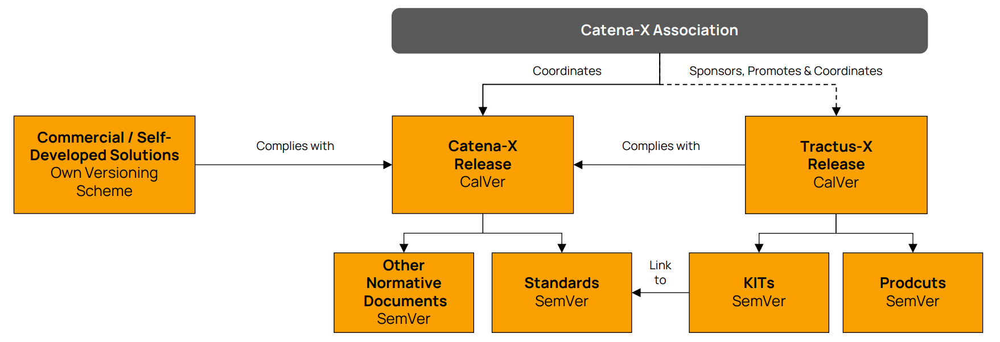

# How: Life Cycle Management

Managing versions and changes of different artifacts in federated data spaces is critical to ensure compatibility, interoperability, and security. The life cycle management of the Catena-X ecosystem is coordinated by the Catena-X Association and includes the releases in the Catena-X Association and in the Eclipse Tractus-X Project (see Figure [Overview Life Cycle Management](./how-life-cycle-management.md)). It is planned to provide quarterly releases including **one major** and **three minor** releases per year. Both releases follow calendar versioning (see [CalVer](https://calver.org/)), whereas their artifacts such as standards, normative documents, products, and KITs follow semantic versioning (see [SemVer](https://semver.org/)). To ensure backward compatibility in the future (see Chapter [Backward Compatibility](./../outlook/outlook.md#backward-compatibility)), versioning and passing of predefined test cases of each individual artifact is mandatory.

*Overview Life Cycle Management*

The Catena-X Association release includes all binding and certification-relevant artifacts such as standards (e.g., API-specifications, semantic models) and normative documents for all data space participants. The Tractus-X release contains all open-source products (including services or helm charts) of the cxOS and business applications as well as KITs. In addition, there are various commercial or self-developed solutions for business applications and services following individual release cycles and versioning schemes.

Both the Tractus-X release and any commercial or self developed solutions must adhere to Catena-X standards and other relevant normative documents.

Open-source products are required to fulfill the [Tractus-X release guideline(TRGs)](https://eclipse-tractusx.github.io/docs/release/) and take part in our integration tests to be part of a quarterly Tractus-X release. For critical issues (e. g., security issues), hot fixes may be released to fix a bug in the active Catena-X operating system that interrupts the normal release cycle.
