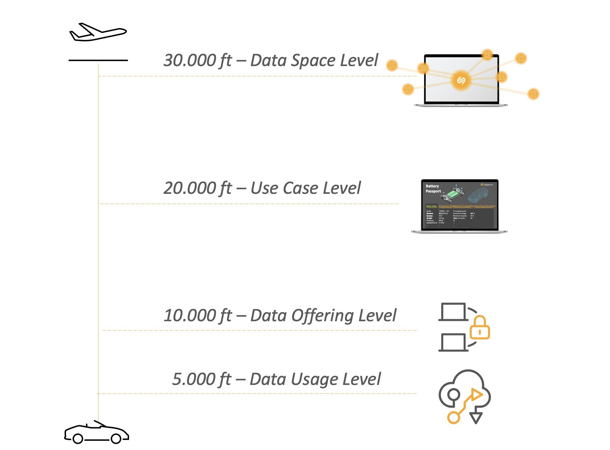

# Governance Framework for Data Space Operations

Catena-X is committed to operating in compliance with all applicable laws and regulations, and we recognize the importance of transparency and accountability in our data space operations. To that end, we continue to develop a holistic Governance Framework that outlines the requirements and responsibilities for all stakeholders involved in our activities.

Maintaining and updating our Regulatory Framework for data space operations lies within the responsibility of the Catena-X Association.

Our Governance Framework for data space operations is designed to follow the highest standards of legal conduct. It includes detailed information on data sovereignty, mandatory use case requirements, and other legal considerations that are relevant to our activities.

To easily grasp the layers of our Governance Framework, think of flight level as a metaphor. The 30,000ft level provides the overall framework; 20,000ft is for specific use cases, 10,000ft for individual data offerings, and 5,000ft for automated contract negotiations. Each higher-level cascades into the lower ones, and the lower levels align with those above.

## 30,000ft - Data Space Level

At this level, the Governance Framework is defined by the Catena-X association and serves as the basis for the certification of Core Service Providers (CSP) A and B. The "Golden Rules" document, which outlines the basic principles of the data ecosystem, is published by the Catena-X association and provides clear guidelines for necessary specifications at lower levels. It also specifies how far a technical standard can go. The agreement between the CSPs and participants (e.g., data providers and data consumers) is established during onboarding.

## 20,000ft - Use Case Level

At this level, the Catena-X association provides dedicated guidelines for each use case and participants must confirm compliance with the standards and conditions to participate in a specific use case. This is an essential piece that is unique to the Catena-X data space in order to allow our use cases to scale across the network and multiple tier levels. The CSP A/B are responsible for capturing this information. The "Use Case Policy" is published by the association and includes a set of "check questions" to guide the creation of use case documents. These questions include "who, with whom, what, where from and where to, why, how, and when." Partners must confirm their participation in a specific use case through a participation statement to the CSP B. Technical standards for use cases, such as semantic models, roles, rights, and APIs, are standardized by the association.

## 10,000ft - Data Offering Level

At this level, participants configure specific data offerings while the Catena-X association provides a framework and structure for individual adjustments (for non-mandatory scope). The association details usage policies in the "Use Case Framework Document," including selected building blocks for individual customization. The association prioritizes the agreement of data exchange parties for non-mandatory scope. Access policies, such as who (defined by BPN, role, etc.) can access a specific data asset, are also defined at this level. Outside the beta phase, release 3.2 offers adjustment building blocks.

## 5,000ft - Data Usage Level

At this level, automated negotiations of data usage contracts between participants for specific data offerings (as defined at 10,000ft) occur through the Eclipse Data Space Connector (EDC). A data usage contract with the EDC (decentralized and key-signed protocol for data usage logging) can specify which partners, which data assets, and for how long data is used.

We encourage all stakeholders involved in Catena-X's activities to familiarize themselves with our Governance Framework for data space operations and understand the requirements and obligations that apply to them as we continue to publish them. By working together in a transparent and accountable manner, we can build a trusted, scalable and efficient data exchange network for the automotive industry.

Stay tuned for further building blocks to our governance framework for data space operations in the coming weeks, such as the following Use Case policies:

- "Digital behavior twin".
