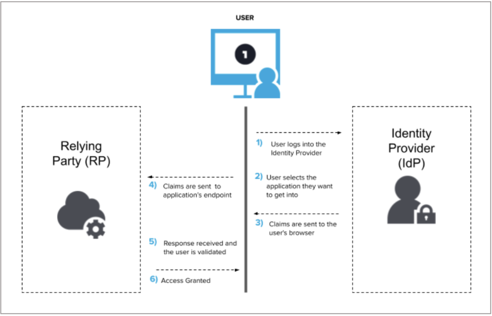
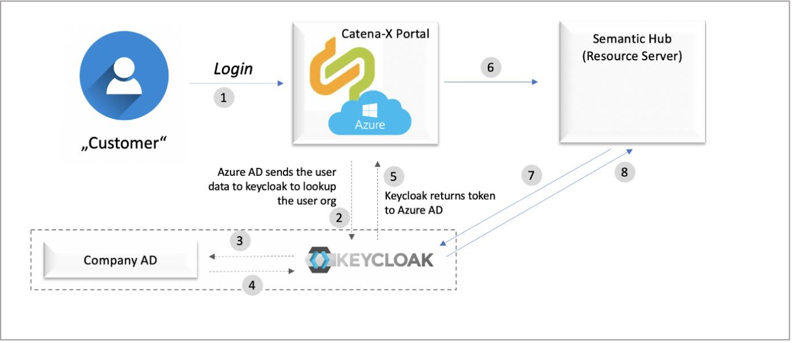
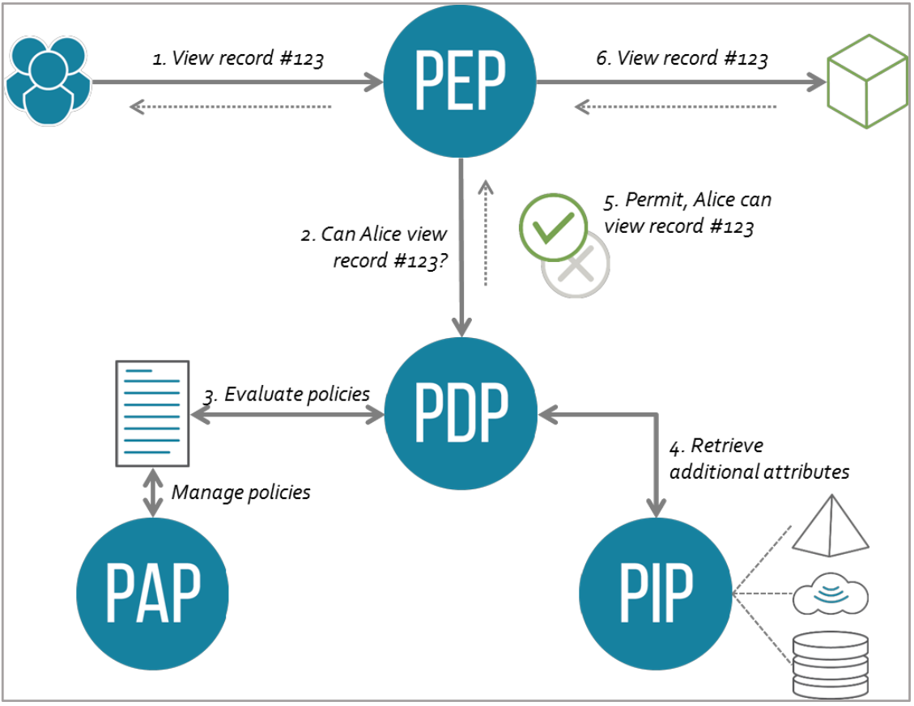

# CX-0015 IAM & Access Control Paradigm for Users and Clients v1.0.1

:::info
This standard is not certifiable yet
:::

## ABSTRACT

The purpose of this standardization is to establish a decentralized and dynamic IAM for the interaction between a providing and a consuming company based on ABAC.

## 1. Introduction

As Identity and Access Management (IAM) is a mandatory basic infrastructure for every IT-System Catena-X will offer an implementation of an IAM solution of some sort for e.g., SMEs and rights/roles management within the CX network. The identity of any entity and actor (company, user, or technical client/connector) is the summary of the describing attributes (e.g., company name, address, tax number...). Catena-X is intended to be a network-of-networks. Consequently, there cannot be a single Identity Provider (IdP) for the company identities nested in one network. The company must be identifiable in an independent way and interoperable in all networks. The identity of users (employees of a company) and technical users (e.g., EDC) in Catena-X, must be bound to the company they are acting on behalf of.

To realize this, a decentralized and dynamic IAM must be established. Here, for the interaction between a providing and a consuming company, the providing company must be able to grant access to a user of a consuming company. To realize this, a roles-and-rights concept must be realized that allows a dynamic authorization assignment to the user of a consuming company in a consistent way. To prevent a role explosion and ensure future scalability with the rising complexity, the dynamic access control will be based on consistent user attributes assigned to the user by the consuming company and processed by the providing company implemented by OpenID Connect and an attribute-based access control (ABAC) mechanism.

### 1.1 AUDIENCE & SCOPE

> *This section is non-normative*

List for which roles the standard is relevant:

- Data Provider / Consumer
- Business Application Provider
- Onboarding Service Provider

### 1.2 Context

> *This section is non-normative*

Standardization for the establishment of a decentralized and dynamic IAM for the
interaction between any participant based on ABAC.

### 1.3 Conformance

As well as sections marked as non-normative, all authoring guidelines,
diagrams, examples, and notes in this specification are non-normative.
Everything else in this specification is normative.

The key words MAY, MUST, MUST NOT, OPTIONAL, RECOMMENDED, REQUIRED,
SHOULD and SHOULD NOT in this document are to be interpreted as
described in [BCP
14](https://datatracker.ietf.org/doc/html/bcp14) \[[RFC2119](https://www.w3.org/TR/did-core/#bib-rfc2119)\]
\[[RFC8174](https://www.w3.org/TR/did-core/#bib-rfc8174)\] when, and
only when, they appear in all capitals, as shown here.

### 1.4 Proof of Conformity

> *This section is non-normative*

All participants and their solutions will need to prove they conform with the
Catena-X standards. To validate that the standards are applied correctly, Catena-
X employs Conformity Assessment Bodies (CABs).

A test bed must be set up, to prove the correctness of the data provisioning. A
generic test set of data must get processed, to prove the expected results.

All Business Application Provider SHOULD provide an identity and access
management for the users of the Data Consumers and Service Customers that

- SHOULD NOT have a static Access Management like
  - An Access Control List (ACL)
  - A Role Based Access Control (RBAC) method
- SHOULD have a dynamic access management based on policies rules and attribute repositories

If a dynamic access management is not provided then it SHOULD be either

- An Access Control List (ACL)
- A Role Based Access Control (RBAC) method
An application provided by a Business Application Provider SHOULD have an
implementation of the following four building blocks

- Policy Administration Point
- Policy Decision Point
- Policy Information Point
- Policy Enforcement Point

These building blocks can be a single dedicated function in the application.
Every Application provided by a Business Application Provider MUST prevent
unauthorized access to the Application. Especially valuable goods must be
protected from unauthorized access by a 3rd party.

To proof that these the access management compo, please collect the following
documentation so that conformance with the standard can be validated:

- Arch42 Document explaining the architecture of the implemented solution
- openAPI specification of the APIs of the implemented solution.

Hand in this documentation to the conformity assessment body.
https://github.com/eclipse-tractusx/item-relationship-service

### 1.5 Terminology

> *This section is non-normative*

Not applicable.

## 2. OpenID Connect

Apps define their rights-and-roles concept independently of Catena-X. The roles (not permissions) that the app uses are created/registered in Catena-X as part of the integration into the CX portal. As soon as an end-user subscribes to an app, the corresponding roles can be assigned to him directly in the portal. Furthermore, member companies shall be able to federate their user base into the CX Network, so that the end-user has a seamless experience from the company network to the business app. Permission federation from member company IdPs into the CX IdP is currently out of
scope.

The currently only used authentication protocol is OpenID Connect (OIDC). Here, OpenID Connect 1.0 is a simple identity layer on top of the OAuth 2.0 protocol. It allows clients to verify the identity of the end-user based on the authentication performed by an authorization server, as well as to obtain basic profile information about the end-user in an interoperable and REST-like manner. Its flow of actions is depicted in Fig. 1:

***FIGURE 1: OpenID Connect Flow of Actions***

The corresponding authentication flow of users logging into Catena-X is then as follows:

***FIGURE 2: Authentication Flow – User Login to Catena-X***

In general, Keycloak is used as the single-sign-on solution for the OIDC implementation. Keycloak is an Open-Source IAM solution, this means that it is an authentication and authorization Java-based server. Keycloak is developed by Red Hat and can be deployed to OpenShift using its official Docker image. Red Hat is a trusted entity for IT Security, so this project is also trustable. In terms of features, Keycloak provides a login page that can be customized to match the app theme. Single-sign-on allows the user to log in once to access all the apps. Moreover, Keycloak follows standard protocols such as OAuth 2.0, OIDC 1.0, SAML 2.0 and supports multi-factor authentication as well as social logins, such as Google, Facebook, and Twitter. It provides centralized user management, which creates a single point of truth to set the permissions of users and roles and is also supporting directory services.

The main structure in Keycloak is called Realm. It is a container that stores all the other elements. Clients are applications that are to be secured, while Identity-Providers (IdP) give the possibility to log in via an external IdP. In addition, user federation uses the Keycloak login page with an external user store and themes modify Keycloak’s login page to match the corporate solution. Moreover, Keycloak's login page uses Angular and users can be assigned to roles per Realm or per client.

Different IdPs are available for Keycloak, whereas OIDC is selected for Catena-X as a connection to WebEAM.Next could be secured by using OIDC. With it, the WebEAM.Next login could authenticate the user and generate its token.

Furthermore, Quarkus has an extension to use Keycloak to manage OIDC. The extension will map the URIs of the protected resources of Keycloak and evaluate the permissions, accordingly, granting or denying access depending on the permissions that will be conferred by Keycloak. Following the official Quarkus/Keycloak guide, the Quarkus properties set the details of the connection between the two systems.

Essentially, Keycloak authenticates the user at the first server the access with a username and password takes place. After the authentication, the user receives a Keycloak token that is valid for only one session. The token is used to identify the user on other servers in the same Domain Name System where the servers are configured to use Keycloak. Hence, the user enters a username and password only once, while there is also only one access to the user directory to verify the identity of that user.

To setup KeyCloak the following steps must be followed:

1. Install Keycloak
2. Load balancer / Cluster Concept
3. Configure Master
4. Create Realms
5. Create Clients
6. Define one or more Roles for the client. The roles correspond to EBICS Client permissions that are used by EBICS Client in access control. Note: In this version of EBICS Client, there is one unique, global-access role.
7. Optionally, you can create Groups, which are logical groupings or sets of permissions.
8. Create Users. These are the users who will be able to access the EBICS Client application.
9. Assign roles to the users.

Overall, the final interaction between Keycloak and CX web applications looks as follows:

***FIGURE 3: INTERACTION BETWEEN KEYCLOAK AND C-X WEB APPLICATIONS***

:::note
Note: (Schatten-) User: The „Schatten-User“ is defined as an empty User frame holding limited information. The actual user is managed in the respective Identity Provider. The Schatten-User are always federated identities.
:::

Publicly available developer documentation can be found on [https://www.keycloak.org/](https://www.keycloak.org/) and GitHub ([https://github.com/keycloak/keycloak](https://github.com/keycloak/keycloak)). Moreover, there is also documentation for OpenID
Connect available: [https://openid.net/connect/](https://openid.net/connect/).

# ATTRIBUTE-BASED ACCESS CONTROL (ABAC)

While role-based access control (RBAC) determines access based on a user's organizational role, ABAC uses user and object attributes to do this. The flexible use and combination of variables increase the flexibility and accuracy of authorization assignment and is used for the purpose of Catena-X.

ABAC in Catena-X is realized through eXtensible Access Control Markup Language (XACML)
therefore five XACML roles are defined first, as follows:

| Role-Abbr. | Role-Term | Role Description |
|:---:|---|---|
| PAP | Policy Administration Point | Point which manages access authorization policies |
| PDP | Policy Decision Point | Point which evaluates access requests against authorization policies before issuing access decisions |
| PEP | Policy Enforcement Point | Point which intercepts user’s access request to a resource, makes a decision request to the PDP to obtain the access decision (i.e., access to the resource is approved or rejected), and acts on the received decision |
| PIP | Policy Information Point | The system entity that acts as a source of attribute values (i.e., a resource, subject, environment) |
| PRP | Policy Retrieval Point | Point where the XACML access authorization policies are stored, typically a database or the filesystem. |

Given the XACML roles, the corresponding flow of actions is depicted in Fig. 7 along with their explanations.

***FIGURE 4: FLOW OF ACTIONS (XACML)***

1. A user sends a request which is intercepted by the Policy Enforcement Point (PEP)
2. The PEP converts the request into an XACML authorization request
3. The PEP forwards the authorization request to the Policy Decision Point (PDP)
4. The PDP evaluates the authorization request against the policies it is configured with.
5. The policies are acquired via the Policy Retrieval Point (PRP) and managed by the Policy
Administration Point (PAP).
6. If needed it also retrieves attribute values from underlying Policy Information Points (PIP).
7. The PDP reaches a decision (Permit / Deny / NotApplicable / Indeterminate) and returns it to the PEP

The presented approach is realized in Catena-X as follows:

***FIGURE 5: XACML REALIZATION IN CATENA-X)***

Further Information about XACML in the context of international data spaces can be found in the position paper by the IDSA:

- [https://internationaldataspaces.org/wp-content/uploads/dlm_uploads/IDSA-Position-Paper-Usage-Control-in-the-IDS-V3..pdf](https://internationaldataspaces.org/wp-content/uploads/dlm_uploads/IDSA-Position-Paper-Usage-Control-in-the-IDS-V3..pdf)

In addition, GitHub contains frontend and backend developer documentation with regards to the IAM:

- GitHub Frontend: [https://github.com/catenax-ng/product-portal-frontend](https://github.com/catenax-ng/product-portal-frontend)
- GitHub Backend: [https://github.com/catenax-ng/product-portal-backend](https://github.com/catenax-ng/product-portal-backend)

## 3. References

Not applicable.

## Legal

Copyright © 2024 Catena-X Automotive Network e.V. All rights reserved. For more information, please visit [here](/copyright).
