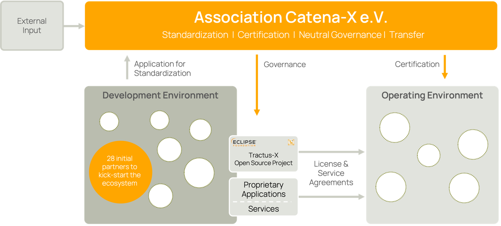

The Catena-X ecosystem consists of three areas

1. [Catena-X Automotive Network e.V.](01-ecosystem.md#catena-x-automotive-network-ev)
2. [Development Environment](01-ecosystem.md#development-environment)
3. [Operating Environment](01-ecosystem.md#operating-environment)

## Catena-X Automotive Network e.V'.'

The **Catena-X Automotive Network e.V.** (in the following called 'Association') is responsible for standardization, certifications, and governance of the Catena-X ecosystem. The Association embraces the following industry partners:

- Direct partners (e.g., OEMs, suppliers, recyclers)
- Indirect partners (e.g., business application and service providers)
- Consulting partners (e.g., research institutes, transfer centers)

Members of the Association can participate in [Committees](../02-organizational-structure/overview-roles/catena-x-roles.md#Committee) and [Expert Groups](../02-organizational-structure/overview-roles/catena-x-roles.md#expert-group).

## Development environment

The Association is complemented by the **development environment**. The focus of the development environment is on the one hand on the creation of standardization candidates that can be submitted into the standardization process of the Association, and on the other hand, the development of open-source reference implementations and other implementations for the dataspace.

## Operating environment

In the **operating environment**, the various open source and commercial services and business applications are operated by different providers. A detailed description of the [provider roles](https://catenax-ev.github.io/docs/next/operating-model/who-roles-in-the-catena-x-ecosystem) and the associated [software components](https://catenax-ev.github.io/docs/next/operating-model/what-service-map) can be found in [Operating Model](https://catenax-ev.github.io/docs/next/operating-model/operating-model).

The Catena-X Association publishes standards with the goal of enabling interoperability, data sovereignty, and security for all participants in the data space. The ecosystem participants must comply with the standards published by the Catena-X Association in order to work with the data space. Catena-X standards build on Gaia-X / *International Data Space Association* (IDSA) concepts and principles, industry standards, and best practices, among others, and extends these by automotive domain and use case specific requirements. By certifying ecosystem participants and software components the Catena-X Association ensures transparency and trust in the ecosystem. A certification testifies, for example, that a software component is interoperable, data sovereign and safe to use in the Catena X data space.

## How to contribute and shape the ecosystem?

Contribute to...

- **Specifications and Standards** in the Catena-X Association by working in [Committees](../02-organizational-structure/overview-roles/catena-x-roles.md#Committee) and [Expert Groups](../02-organizational-structure/overview-roles/catena-x-roles.md#expert-group)
- **Reference Implementations** by implementing features, improvements, bugs, new service etc. in the [Tractus-X](https://eclipse-tractusx.github.io/) Project that comply with the Catena-X standards
