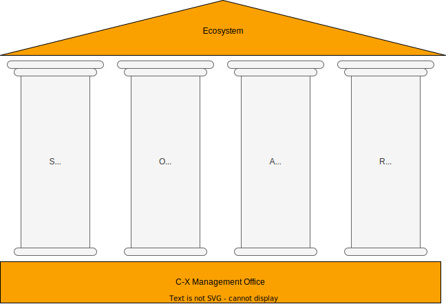

## RASIC matrix for association bodies

|  | R = Responsible; A = Accountable; S = Supportive; I = Informed; C = Consulted | Management board |  | Committee |  |  | Expert Group |  | Catena-X office |
|---|---|---|---|---|---|---|---|---|---|
|  |  | Member | [Sponsor](management-board.md#board-sponsor) | [Lead](committee.md#lead-and-co-lead) | Member | [Mentor](committee.md#mentor-for-expert-groups-optional) | Lead | Member |  |
| Strategy | [Develop and maintain the Association strategy](management-board.md#association-strategy) | A | R | I |  |  | I |  | S |
|  | [Develop and maintain the business domain strategy](committee.md#business-domain-strategy) | I | A,C | R | S |  | I | I | S |
|  | [Develop and maintain a strategy on functional level](expert-group.md#functional-level-strategy)  |  | I | A |  | C | R | S | S |
| Mgmt. of association bodies | Setup Committees | R,A |  |  |  |  |  |  | S |
|  | Close Committees | A | R | C | I |  |  |  |  |
|  | Setup Expert Groups |  | C | A |  | R |  |  | S |
|  | [Close Expert Groups](expert-group.md#closing-of-expert-groups) |  | C | A |  | R | C,I | I | S |
| Development | [Develop new feature requests](../../process-structure/process-from-idea-to-production.md#create-new-feature-proposal) |  |  |  |  | C | A | R |  |
|  | [Approve features requests](../../process-structure/process-from-idea-to-production.md#check-strategic-fit) |  |  |  | R | A | S | I |  |
|  | Foster the development of features by providing development resources | S |  |  |  | S |  | A,R |  |
|  | Remove impediments for the features development / for Expert Group(s) |  | C |  | S | R |  |  |  |
| Promote | [Promote the use cases of the business domain inside and outside the association](committee.md#communication) | S | C |  | R | A |  |  | S |

The RASIC should provide an overview of the tasks the Association bodies are engaging in. Each individual in the Mgmt. board, a Committee or an Expert Group is at least a "member". If one takes over additional roles, e.g. as "Lead", the responsibilities of that role are added to those as member. In detail, the responsibilities for specific individual aspects may differ slightly (but always in alignment with this overarching RASIC.

## SOAR

As the association, all four bodies aim to advance Catena-X as the leading global data ecosystem for the automotive value chain. In order to do so they follow the SOAR model.

- **S** = Standardizes to lay the foundation/basis for the ecosystem
- **O** = Orchestrates to structure and organize the ecosystem
- **A** = Activates by making standards applicable and relevant
- **R** = Represent as the only ones speaking for Catena-X

## Escalation path

If an issue cannot be resolved by the designated association body, it must be escalated to the appropriate higher authority. The escalation pathway is as follows:

1. **Expert Groups**: Issues should initially be addressed within the Expert Groups. If the Expert Group Members are unable to find a solution, a vote may be conducted to reach a decision. Should the vote fail to achieve a majority or if an Expert Group member raises substantial concerns regarding the outcome, the issue may be escalated.
2. **Responsible Committee**: If the Expert Groups are unable to resolve the issue, it is escalated to the responsible committee. This committee is tasked with oversight and decision-making based on broader organizational perspectives.
3. **Board Sponsors**: Should the committee find the issue beyond its scope of resolution, the matter is escalated to the Board Sponsors. These senior members of the board provide strategic guidance and authoritative decisions on escalated matters.
4. **Mediation Board Member**: As the final level of escalation, unresolved issues are directed to a Mediation Board Member. This individual is empowered to mediate and resolve high-level disputes or complex issues that could not be settled at prior levels.
