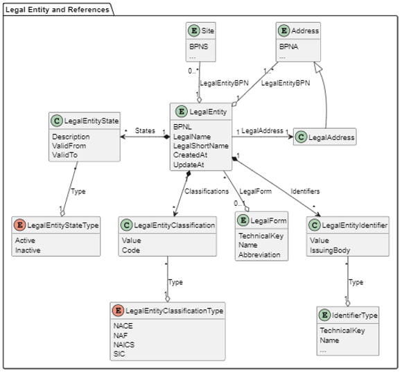
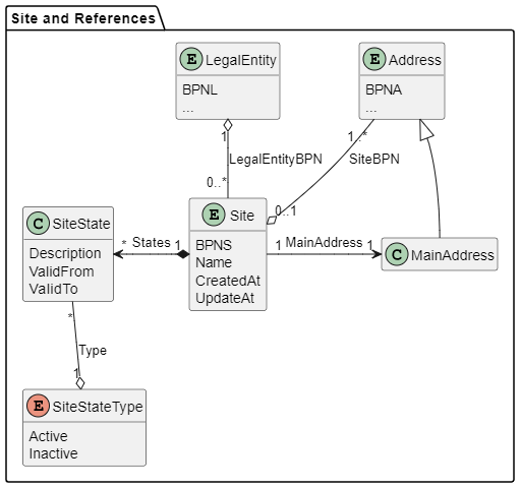
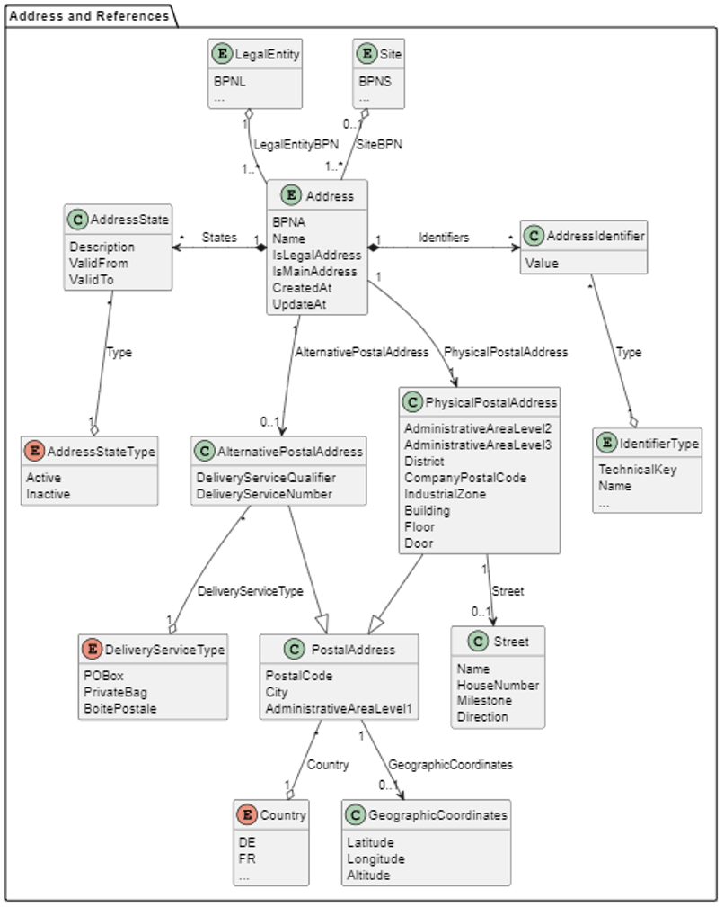
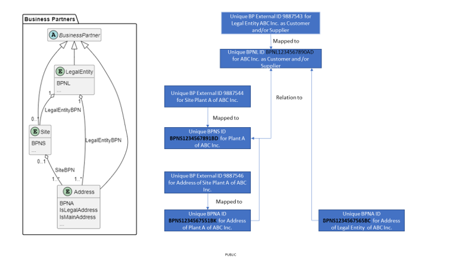
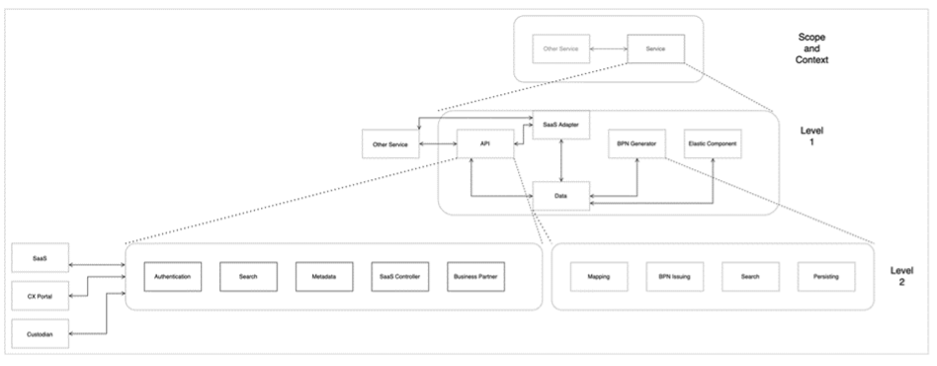
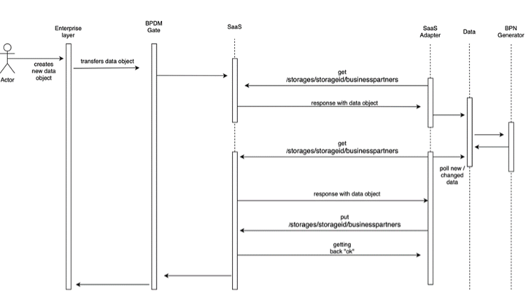

# CX-0010 Business Partner Number v2.0.0

## ABSTRACT

The Business Partner Data Management (BPDM) is a distributed service-based system, composed of a set of dedicated services, that simultaneously serve multiple stakeholders. It is based on a central data pool of business partners, which is consistent with the overall design principles of Catena-X. The main target is to create business partner data records (such as customer/supplier) with a high quality and currentness, to provide other processes with these data. This results in less rework and adjustment due to better master data quality which ultimately leads to an overall cost reduction for participating companies. Additionally, Value Added Services shall be offered to enrich those business partner data sets even further and give additional information or warnings about the business partners. Getting a 360° view on your business partners also helps with reducing costs and achieving process excellence because better decisions can be made.

The Business Partner Number (BPN) is a unique identifier that is assigned to each business partner. The following represents the technical documentation for the Business Partner Number in the platform capability Business Partner Data Management. This standard documentation defines the structure and creation of a Business Partner Number.

## 1. INTRODUCTION

### 1.1 AUDIENCE & SCOPE

> *This section is non-normative*

This standard is relevant for the following audience:

- Core Service Provider
- Onboarding Service Provider
- Business Application Provider
- Data Provider and Consumer

This document focuses on the Business Partner Number (BPN) and its issuing agency that is part of the Business Partner Data Management (BPDM) described on the [BPDM Catena-X Website](https://catena-x.net/en/offers/bpdm).It is relevant for core service providers who want to provide services for retrieving a cleansed, high-quality business partner data record (Golden Record) for a given Business Partner Number. It is also relevant for onboarding service providers, business application providers as well as data providers and consumers who want to use such services.

The BPN is the one unique identifier for business partners in the network. To maintain the issuing agency, core service providers especially need to get an understanding on the syntax of the BPN, the versions, and relations. In addition to that the lifecycle of a BPN is important.

Not in scope is the way of how business partner data records can be shared to create a Golden Record. There is a separate standard for this: Business Partner Gate API.

Not in scope is the overall Business Partner Pool with all Golden Records within Catena-X and the way of how the Golden Records can be retrieved. There is a separate standard for this: Business Partner Pool API.

Not in scope are the requirements of cleansing and enriching the business partner data records with the aim to create a Golden Record. A separate standard is being prepared but will not be available simultaneously with this standard.

You can find the other standards in the standard library of Catena-X: [https://catena-x.net/de/standard-library](https://catena-x.net/de/standard-library).

### 1.2 CONTEXT

> *This section is non-normative*

It is not only with the founding of various industry networks (such as Catena-X) that the requirements increase to establish data standards for the entire automotive value chain and to promote the industry-wide, international data exchange. For the networking of OEMs, suppliers, customers, and industrial partners, it is essential to define and introduce a cross-industry standard for identifying business partners to map the entire supply chain in a sustainable manner.

### 1.3 CONFORMANCE

As well as sections marked as non-normative, all authoring guidelines, diagrams, examples, and notes in this specification are non-normative. Everything else in this specification is normative.

The key words MAY, MUST, MUST NOT, OPTIONAL, RECOMMENDED, REQUIRED, SHOULD and SHOULD NOT in this document are to be interpreted as described in [BCP 14](https://datatracker.ietf.org/doc/html/bcp14) [[RFC2119](https://www.w3.org/TR/did-core/#bib-rfc2119)] [[RFC8174](https://www.w3.org/TR/did-core/#bib-rfc8174)] when, and only when, they appear in all capitals, as shown here.

### 1.4 PROOF OF CONFORMITY

> *This section is non-normative*

All participants and their solutions will need to proof, that they are conform with the Catena-X standards. To validate that the standards are applied correctly, Catena-X employs Conformity Assessment Bodies (CABs).

To proof conformity with this standard, a self-audited, stated and signed document that the syntax of the BPN is established must be provided.

### 1.5 TERMINOLOGY

> *This section is non-normative*

### 1.5.1 General

**Golden Record:** Golden Record defines a business partner data record which successfully passed a set of predefined quality rules. These rules qualified the data record into a harmonized, standardized, and semantically unified data structure which is defined by Catena-X. The Golden Record status is a prerequisite for each BP data record to receive a valid BPN.

**Sharing Member:** A sharing member is a BPDM member who shares the Business Partner data of his own system.

### 1.5.2 Business Partner

In general, a business partner is any entity (such as a customer, a supplier, an employee, or a service provider) that does business with another entity.

In Catena-X, a business partner is an organization (and not a natural person) or one of its substructures (such as an enterprise or company, university, association, etc.) that acts as unique partner within the automotive supply chain – either in the role of a direct participant, or a consultant, or a non-production-material (NPM) supplier.

Catena-X distinguishes between three business partner types to represent an organization with its substructures relevant for the automotive supply chain: legal entity, site, and address (see detailed definitions).

### 1.5.3 Legal Entity

In general, a legal entity is a juridical person that has legal rights and duties related to contracts, agreements, and obligations. The term especially applies to any kind of organization (such as an enterprise or company, university, association, etc.) established under the law applicable to a country.

In Catena-X, a legal entity is a type of business partner representing a legally registered organization with its official registration information, such as legal name (including legal form, if registered), legal address and tax number.

A legal entity has exactly one legal address, but it is possible to specify additional addresses that a legal entity owns. Thus, at least one address is assigned to a legal entity. A legal entity can own sites. Thus, many or no sites are assigned to a legal entity.  A legal entity is uniquely identified by the BPNL.

A BPNL represents and uniquely identifies a legal entity, which is defined by its legal name (including legal form, if registered), legal address and tax number.

### 1.5.4 Site

In general, a site is a delimited geographical area in which an organization (such as an enterprise or company, university, association, etc.) conducts business.

In Catena-X, a site is a type of business partner representing a physical location or area owned by a legal entity, where a production plant, a warehouse, or an office building is located.

A site is owned by a legal entity. Thus, exactly one legal entity is assigned to a site. A site has exactly one main address, but it is possible to specify additional addresses (such as different gates), that belong to a site. Thus, at least one address is assigned to a site. A site can only be uploaded and modified by the owner (the legal entity), because only the owner knows which addresses belong to which site. A site is uniquely identified by the BPNS.

A BPNS represents and uniquely identifies a site, which is where for example a production plant, a warehouse, or an office building is located.

### 1.5.5 Address

In general, an address is a collection of information to describe a physical location, using a street name with a house number and/or a post office box as reference. In addition, an address consists of several postal attributes, such as country, region (state), county, township, city, district, or postal code, which help deliver mail.

In Catena-X, an address is a type of business partner representing the legal address of a legal entity, and/or the main address of a site, or any additional address of a legal entity or site (such as different gates).

An address is owned by a legal entity. Thus, exactly one legal entity is assigned to an address. An address can belong to a site. Thus, one or no site is assigned to an address. An address is uniquely identified by the BPNA.

A BPNA represents and uniquely identifies an address, which can be the legal address of a legal entity, and/or the main address of a site, or any additional address of a legal entity or site (such as different gates).

It is important to note that only the BPNL must be used to uniquely identify a legal entity. Even in the case that the BPNA represents the legal address of the legal entity, it shall not be used to uniquely identify the legal entity.

# 2 BUSINESS PARTNER NUMBER

## 2.1 BPN

The BPN is a unique, unchangeable identifier for business partners from foundation to closure, regardless of the different business relationships / structures between or within the business partners or company locations. It MUST follow the defined syntax and structure:

| **Prefix** | **Classification** | **Identifier** | **Check Digit** |
| --- | --- | --- | --- |
| 3-digit | 1-digit | 10-digit | 2-digit |
| Issuing Agency Code according to ISO/IEC 15459 e.g. BPN | L = Legal Entity S = Site A = Address | alphanumerical | 2-digit verification algorithm according to ISO 7064 MOD 1271-36 |

Further information:

The following input or reading aid SHOULD be used for human readable representation of the BPN: BPNL 1234 5678 90ZZ

## 2.2 Lifecycle

The BPNs of a legal entity (BPNL), a site (BPNS), or an address (BPNA) have an own life cycle, depending on the respective status of the legal entity, the site, or the address in the real world.

Each BPNL, BPNS and BPNA data record contains a start and end date which defines the validity duration of the related data record.

They MUST follow the status definitions

- active
- inactive

## 2.3 Relations

There are relations between a legal entity (BPNL), its sites (BPNS), and its addresses (BPNA). Each organization in the real world (such as an enterprise or company, university, association, etc.) is represented by one legal entity. Each legal entity MUST have at least one address which is its legal address. If a site exists it MUST be associated exactly to one legal entity. A legal entity MAY have multiple sites. Each site MUST have at least one address which is its main address. See example under 2.4 for explanation.

## 2.4 Examples

Exemplary BPN: BPNL1234567890ZZ

**BPN:** is used here as a placeholder for the issuing agency according to IDO/IEC 15459.

**L:** identifies the legal entity of the business partner

**ZZ** : is the individual check digit, which is formed according to ISO 7064.

Example *ABC Inc.* with its relatedsubstructures:

## 2.5 Out of Scope

For the following entities a BPN SHALL NOT be issued:

- natural persons (such as employees) who act for a legal entity and not as own business partners
- forms of freight forwarding (such as c/o addresses)
- elements of (legal) hierarchies (such as business global ultimate)
- internal unloading points (logistically)

## 2.6 Issuing Agency

The issuing agency is a technical mechanism that centrally assigns BPNs to ensure the highest data quality in the data sharing process. Catena-X e.V. issues a license through which an operating company MUST operate the mechanism to issue further BPNs. BPNs are issued for legal entities, sites, and addresses. The issuing agency is specified in the prefix of the BPN according to ISO/IEC 15459.

### 2.6.1 Building Block View

The BPDM API receives cleaned data sets from the SaaS Adapter. BPNs are issued centrally. For this purpose, the BPN is assigned on the BPDM side subsequently to the API and the SaaS adapter. The updated data objects are then mirrored back to the other services.

### 2.6.2 Run Time View

This runtime view illustrates the data sharing mechanism between a sharing member, the SaaS component, including the BPN issuing by the BPN Generator. An actor can be any sharing member that shares data with Catena-X. The new data object is transferred from the enterprise layer of the sharing member to the Catena-X gate. This gate interacts with the API of the SaaS component. The SaaS component fetches information about their synchronization and receives the new data objects in response. The BPN generator issues a BPN, and the data objects are changed accordingly. The SaaS adapter polls the changed data. The updated data objects are then available via standardized APIs.

# 3 REFERENCES

## 3.1 NON-NORMATIVE REFERENCES

> *This section is non-normative*

[BPDM Catena-X Website](https://catena-x.net/en/offers/bpdm)

## 3.2 REFERENCE IMPLEMENTATIONS

> *This section is non-normative*

[Business Partner Pool API](https://github.com/eclipse-tractusx/bpdm/tree/main/bpdm-pool-api/src/main/kotlin/org/eclipse/tractusx/bpdm/pool/api)

[Business Partner Gate API](https://github.com/eclipse-tractusx/bpdm/tree/main/bpdm-gate-api/src/main/kotlin/org/eclipse/tractusx/bpdm/gate/api)

# ANNEXES

## FIGURES

> *This section is non-normative*

Intentionally left blank.

## TABLES

> *This section is non-normative*

Intentionally left blank.
